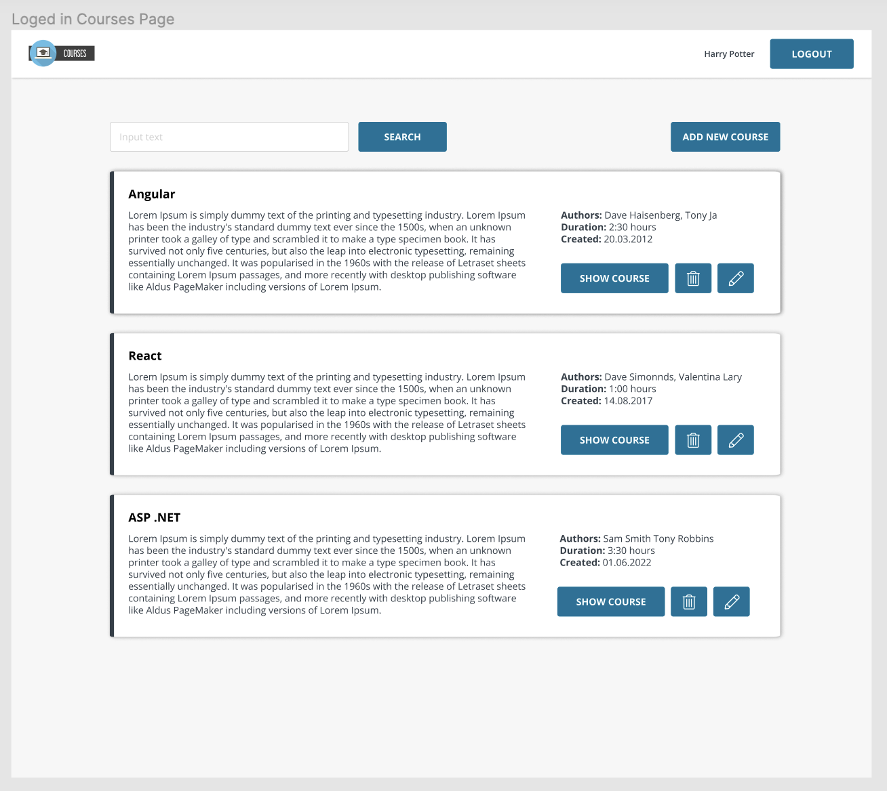

# React Fundamentals

## Agenda
[Module 1: React Components](#module-1-react-components)

___
### Module 1: React Components

**Setup**
  - create React app
  - configure `eslint` and `prettier`
  - configure `pre-commit` hook (`husky`)
  - install `sass`

**Implement UI**

UI based on react components 
- Header
- Logo
- Button
- Input
- CourseInfo
- Courses
- CourseCard
- SearchBar
- EmptyCourseList

____